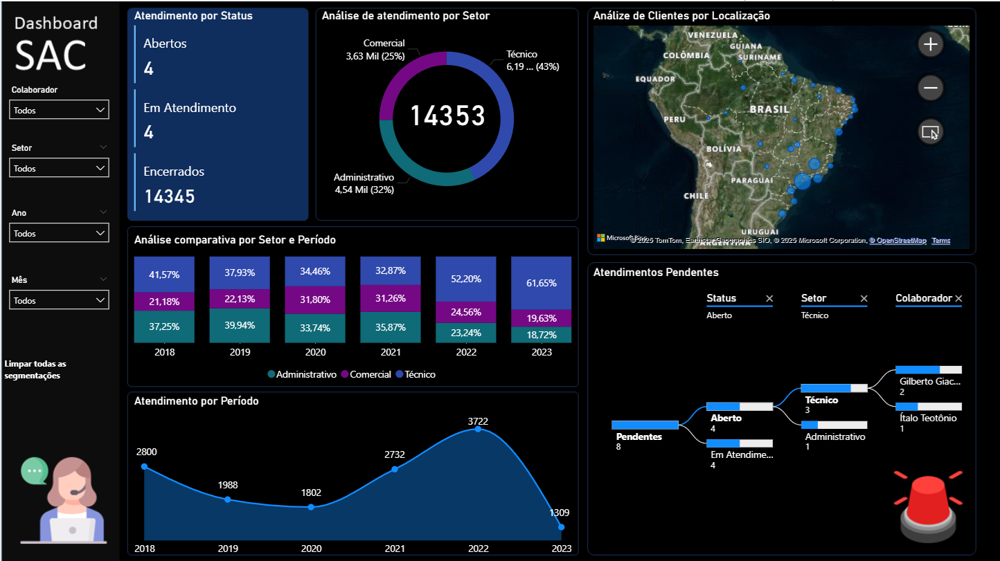

# 🎧 Dashboard de Gestão de Atendimento (SAC) e Service Desk

> **Status:** Concluído ✅
> 

## 📌 Contexto do Negócio

Este projeto foi desenvolvido para solucionar o desafio de monitoramento da central de atendimento ao consumidor. A gestão precisava de visibilidade sobre o volume de chamados, a eficiência da equipe na resolução de problemas e a identificação de gargalos regionais.

O dashboard oferece uma visão consolidada das requisições, permitindo identificar rapidamente se a demanda está sendo atendida ou se há acúmulo de pendências (backlog).

## 📊 Principais Indicadores e Análises

O relatório responde às seguintes perguntas estratégicas de negócio:

* **Volume e Sazonalidade:** Qual o total de requisições feitas por ano? Houve aumento na demanda?
* **Status da Operação:** Quantas solicitações ainda estão **abertas** (esperando solução) vs. quantas foram concluídas?
* **Análise Regional:** De quais regiões/estados estão vindo a maior parte das solicitações? (Mapa de calor).
* **Performance por Setor:** Quais departamentos (ex: Financeiro, Suporte, Vendas) são mais acionados pelos clientes?
* **Produtividade da Equipe:** Quem é o colaborador responsável por cada resposta e qual o volume de atendimentos por pessoa?

## 🛠️ Ferramentas e Técnicas Utilizadas

* **Power BI Desktop:** Ferramenta principal de desenvolvimento.
* **Tratamento de Dados (ETL):** Limpeza e padronização da base de chamados.
* **Modelagem de Dados:** Relacionamento entre a tabela de Solicitações (Fato) e as tabelas de Colaboradores e Regiões (Dimensão).
* **Visualização de Dados:**
    * Uso de mapas para inteligência geográfica.
    * Gráficos de barras para ranking de colaboradores e setores.
    * Cartões de KPI para monitoramento de chamados em aberto.

## 🚀 Como Executar o Projeto

1.  Baixe o arquivo `.pbix` deste repositório.
2.  Abra no Microsoft Power BI Desktop.
3.  Utilize os filtros para navegar entre os anos ou selecionar um setor específico para ver a performance detalhada.

---
*Desenvolvido por Bruno Lemos*
*Conecte-se comigo no [LinkedIn](www.linkedin.com/in/bruno-lemos-dados)*
